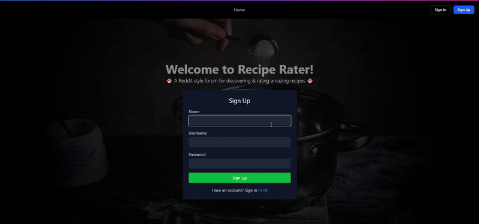
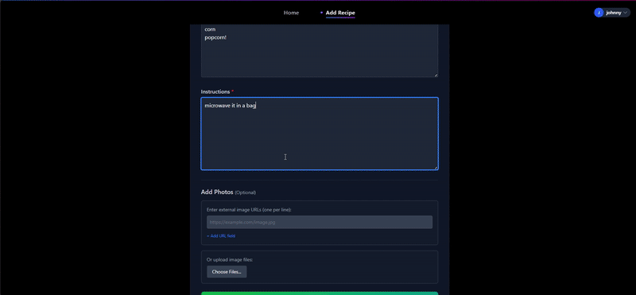

<h1 align="center">🍲 Recipe Rater 🍲</h1>
<p align="center">
  <a href="https://github.com/alia720/Recipe-Rater" target="_blank">View on GitHub</a>
  &nbsp;|&nbsp;
  <a href="https://frontend-production-1d79.up.railway.app/" target="_blank">Live Demo</a>
</p>
<p align="center"><em>Final project for CPSC 471: Database Design</em></p>

<p align="center">
  
  
  
  
  
</p>

---

## About This Project

Recipe Rater is a full-stack web application that lets users browse, create, rate, comment on, and categorize recipes.  
Built with React, Node.js, Express, MySQL, and TailwindCSS, it features secure authentication (Admin & Customer roles), image uploads, and an admin view for content moderation.

---
## Demo & GIFs

Explore key flows via dropdown:

<details>
  <summary>📝 Signup Demo</summary>

  <p align="center">
    
  </p>
</details>

<details>
  <summary>➕ Add Recipe Demo</summary>

  <p align="center">
    
  </p>
</details>

<details>
  <summary>👤 Profile Demo</summary>

  <p align="center">
    
  </p>
</details>

## Technologies & Tools

- **React** for dynamic, component-based UIs  
- **TailwindCSS** for utility-first styling  
- **Node.js** & **Express** for RESTful API backend  
- **MySQL** for relational data storage  
- **React Router** for client-side navigation  

---

## Prerequisites

- **Node.js** (v14+)
- **MySQL** (installed & running)
- **npm** or **yarn**

---

## Installation

1. **Clone the repo**  
   ```bash
   git clone https://github.com/alia720/Recipe-Rater.git
   cd Recipe-Rater
   ```

2. **Install dependencies**  
   ```bash
   # Frontend
   cd frontend
   npm install

   # Backend
   cd ../backend
   npm install
   ```

3. **Configure environment**  
   In `backend/.env`:
   ```env
   DB_HOST=127.0.0.1
   DB_PORT=3306
   DB_USER=root
   DB_PASSWORD=your_password
   DB_DATABASE=recipe_db
   ```

4. **Initialize database**  
   - Create a MySQL database named `recipe_db`  
   - Import the schema from `backend/recipe.sql`

---

## Running the Application

1. **Start backend**  
   ```bash
   cd backend
   npm start
   ```
   Backend runs at: `http://localhost:5000`

2. **Start frontend**  
   ```bash
   cd frontend
   npm run dev
   ```
   Frontend runs at: `http://localhost:5173`

---

## API Documentation

<details>
<summary><strong>📋 API Requests</strong></summary>

<details>
<summary>🔑 Authentication</summary>

- **POST** `/api/users/register` – Register a new user  
- **POST** `/api/users/login` – User login  
- **POST** `/api/users/logout` – User logout  
- **GET** `/api/users/profile` – Get current user profile  
- **POST** `/api/customers/login` – Customer login  
- **POST** `/api/admins/login` – Admin login  

</details>

<details>
<summary>🍽 Recipes</summary>

- **GET** `/api/recipes` – Get all recipes  
- **GET** `/api/recipes/:id` – Get recipe by ID  
- **GET** `/api/recipes/user/:userId` – Get recipes by user  
- **GET** `/api/recipes/search` – Search recipes by name  
- **POST** `/api/recipes` – Create new recipe  
- **PUT** `/api/recipes/:id` – Update recipe  
- **DELETE** `/api/recipes/:id` – Delete recipe  

</details>

<details>
<summary>📂 Categories</summary>

- **GET** `/api/categories` – Get all categories  
- **GET** `/api/categories/:id` – Get category by ID  
- **GET** `/api/categories/search` – Search categories by name  
- **POST** `/api/categories` – Create new category  
- **PUT** `/api/categories/:id` – Update category  
- **DELETE** `/api/categories/:id` – Delete category  

</details>

<details>
<summary>🥕 Ingredients</summary>

- **GET** `/api/ingredients` – Get all ingredients  
- **GET** `/api/ingredients/:id` – Get ingredient by ID  
- **GET** `/api/ingredients/search` – Search ingredients by name/type  
- **POST** `/api/ingredients` – Create new ingredient  
- **PUT** `/api/ingredients/:id` – Update ingredient  
- **DELETE** `/api/ingredients/:id` – Delete ingredient  

</details>

<details>
<summary>📷 Photos</summary>

- **GET** `/api/photos` – Get all photos  
- **GET** `/api/photos/:id` – Get photo by ID  
- **GET** `/api/photos/recipe/:recipeId` – Get photos for a recipe  
- **GET** `/api/photos/search` – Search photos by name/caption  
- **POST** `/api/photos` – Upload a new photo  
- **POST** `/api/photos/url` – Add photo from URL  
- **PUT** `/api/photos/:id` – Update photo  
- **DELETE** `/api/photos/:id` – Delete photo  

</details>

<details>
<summary>⭐️ Ratings & 💬 Comments</summary>

**Ratings:**  
- **GET** `/api/ratings` – Get all ratings  
- **GET** `/api/ratings/:id` – Get rating by ID  
- **GET** `/api/ratings/recipe/:recipeId` – Ratings for recipe  
- **GET** `/api/ratings/user/:userId` – Ratings by user  
- **GET** `/api/ratings/recipe/:recipeId/average` – Average rating  
- **POST** `/api/ratings` – Add rating  
- **PUT** `/api/ratings/:id` – Update rating  
- **DELETE** `/api/ratings/:id` – Delete rating  

**Comments:**  
- **GET** `/api/comments` – Get all comments  
- **GET** `/api/comments/:id` – Get comment by ID  
- **GET** `/api/comments/recipe/:recipeId` – Comments for recipe  
- **GET** `/api/comments/user/:userId` – Comments by user  
- **POST** `/api/comments` – Add comment  
- **PUT** `/api/comments/:id` – Update comment  
- **DELETE** `/api/comments/:id` – Delete comment  

</details>

<details>
<summary>👍👎 Likes & Dislikes</summary>

- **GET** `/api/likes-dislikes` – All like/dislike records  
- **GET** `/api/likes-dislikes/user/:userId` – By user  
- **GET** `/api/likes-dislikes/recipe/:recipeId` – For recipe  
- **GET** `/api/likes-dislikes/:userId/:recipeId` – Specific record  
- **POST** `/api/likes-dislikes` – Create record  
- **PUT** `/api/likes-dislikes/:userId/:recipeId` – Update record  
- **DELETE** `/api/likes-dislikes/:userId/:recipeId` – Delete record  

</details>

<details>
<summary>👥 User Management</summary>

**Customers**  
- **GET** `/api/customers` – Get all customers  
- **GET** `/api/customers/:userId` – By user ID  
- **POST** `/api/customers` – Create customer record  
- **PUT** `/api/customers/:userId` – Update record  
- **DELETE** `/api/customers/:userId` – Delete record  

**Admins**  
- **GET** `/api/admins` – Get all admins  
- **GET** `/api/admins/:userId` – By user ID  
- **POST** `/api/admins` – Create admin record  
- **PUT** `/api/admins/:userId` – Update record  
- **DELETE** `/api/admins/:userId` – Delete record  

</details>

<details>
<summary>🔗 Relationships</summary>

**🗑 Admin Removes Rating**  
- **GET** `/api/admin-removes` – All removals  
- **GET** `/api/admin-removes/admin/:adminId` – By admin  
- **GET** `/api/admin-removes/rating/:ratingId` – By rating  
- **POST** `/api/admin-removes` – Create removal  
- **PUT** `/api/admin-removes/:adminId/:ratingId` – Update removal  
- **DELETE** `/api/admin-removes/:adminId/:ratingId` – Delete removal  

**🏷 Recipe Categories (Belongs To)**  
- **GET** `/api/belongs-to` – All assignments  
- **GET** `/api/belongs-to/recipe/:recipeId` – For recipe  
- **GET** `/api/belongs-to/category/:categoryId` – In category  
- **POST** `/api/belongs-to` – Assign recipe  
- **DELETE** `/api/belongs-to/:categoryId/:recipeId` – Remove assignment  

**📤 Recipe Submissions**  
- **GET** `/api/submits` – All submissions  
- **GET** `/api/submits/user/:userId` – By user  
- **GET** `/api/submits/recipe/:recipeId` – For recipe  
- **POST** `/api/submits` – Create submission  
- **PUT** `/api/submits/:userId/:recipeId` – Update submission  
- **DELETE** `/api/submits/:userId/:recipeId` – Delete submission  

</details>

<details>
<summary>🔍 Search & File Upload</summary>

- **GET** `/api/search` – Combined search  
- **POST** `/api/upload` – Upload image file  

</details>

